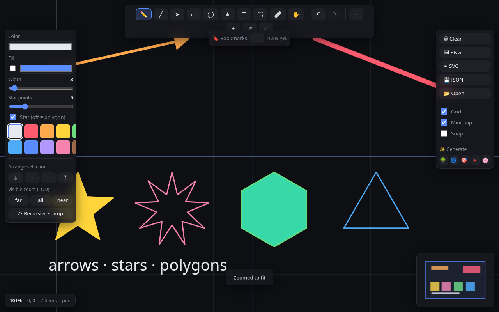
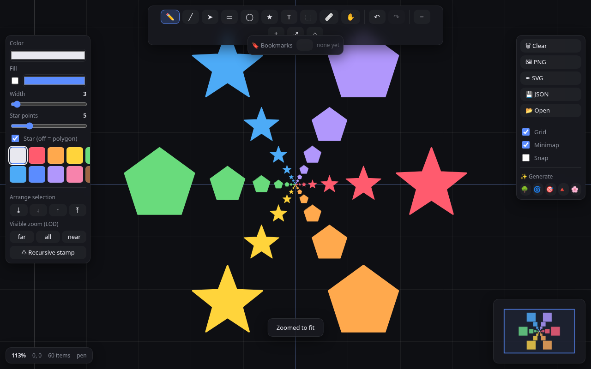

# ∞ Infinizoom

An **infinite-zoom vector drawing app** built with plain JavaScript, HTML, and
CSS — no frameworks, no build step — and driven by an extensive **Playwright
browser-automation test suite**.

Draw on an unbounded canvas, scroll to zoom across ~30 orders of magnitude, and
the lines stay crisp the whole way down (verified at 167,000× in the tests).



## Quick start

```bash
npm install                 # installs Playwright (browser auto-resolved, see below)
npm run serve               # serve at http://127.0.0.1:8231
npm test                    # run the full Playwright suite (auto-starts the server)
node tests/demo.js          # render the showcase gallery into screenshots/
```

Then open the served URL and draw.

## Features

**Drawing tools** — pen (freehand, RDP-simplified), line, arrow, rectangle,
ellipse, star/polygon (3–12 points, star or regular), text, eraser, select, pan.

**Infinite canvas**
- Zoom anchored at the cursor; pan with the hand tool, space-drag, or middle mouse.
- An **adaptive grid** that subdivides through powers of ten so there's always a
  sensible reference at any magnification, with highlighted world-origin axes.
- A **minimap** showing the whole document and the current viewport (click to jump).
- Viewport **culling** keeps it fast — 5,000 items render in ~11 ms; when you zoom
  in, only the handful of on-screen items are drawn.

**Editing** — multi-select (click, shift-click, marquee), move, per-item colour /
width / **opacity**, fill, z-order (front/back/raise/lower), copy/cut/paste,
duplicate, an **eyedropper** (Alt+click to sample a colour), and full undo/redo.

**Infinite-zoom superpowers**
- **Level of detail (LOD):** tag items to appear only when zoomed in (`near`) or
  out (`far`) past the current level — build worlds nested inside worlds.
- **Recursive stamp:** drop progressively smaller copies of a selection toward its
  centre to hand-craft Droste-style fractals you can fall into forever.
- **Bookmarks:** save camera views and *fly* between them with eased, log-space
  zoom — even across billion-fold scale jumps.

**Procedural art generators** — fractal tree, spiral squares, Droste rings,
Sierpinski triangle, flower field (the ✨ buttons).

**Persistence & export** — autosave to localStorage, plus JSON / SVG / PNG export
and JSON import.



## Keyboard shortcuts

| Key | Action | Key | Action |
|-----|--------|-----|--------|
| `P` pen · `L` line · `A` arrow | tools | `Ctrl/⌘ Z` / `⇧Z` | undo / redo |
| `R` rect · `O` ellipse · `S` star | tools | `Ctrl/⌘ A` | select all |
| `T` text · `V` select · `E` eraser · `H` pan | tools | `Ctrl/⌘ C·X·V·D` | copy·cut·paste·dup |
| `+` / `-` | zoom in / out | `Delete` | delete selection |
| `F` | zoom to fit | `]` / `[` | bring to front / send to back |
| `0` | reset view | `Ctrl ]` / `Ctrl [` | raise / lower |
| `G` | toggle grid | `Esc` | clear selection |

Hold `⇧` while drawing a line/arrow to snap angles, or a rect/ellipse/star to
keep it square. **Alt+click** anywhere to eyedrop the colour under the cursor.

## Architecture

```
index.html · style.css        page + UI
src/
  util.js        geometry, RDP simplify, formatting, color helpers
  camera.js      world↔screen transform, zoom-at-cursor, pan, fit
  scene.js       document model: items, bbox, hit-test, pick, JSON I/O
  history.js     undo/redo command stack
  renderer.js    canvas painting: adaptive grid, items (culled), selection
  minimap.js     overview + viewport rectangle
  generators.js  procedural-art functions
  svg.js         vector (SVG) export
  storage.js     localStorage + file import/export
  app.js         input, tools, UI wiring, render loop, and the test API
server.js        zero-dependency static file server
tests/           Playwright specs + standalone demo/smoke scripts
```

Geometry lives in unbounded `f64` **world coordinates**; the camera maps them to
screen pixels. Stroke widths are world-relative, so zooming feels physical.

### The test API

`app.js` exposes `window.__INFINIZOOM__` so tests (and you, from the console) can
drive everything headlessly: tools, styling, camera, items, undo/redo, generators,
LOD, stamp, bookmarks, export, and pixel-level rendering checks. `window.app` is
the live instance.

## Testing notes

The suite covers core loading, drawing each tool, the camera (including deep-zoom
precision and culling), history, persistence, keyboard shortcuts, generators,
LOD, recursive stamp, bookmarks/fly-to, SVG export, clipboard, and performance.

> **NixOS:** Playwright's prebuilt Chromium can't run (missing dynamic linker), so
> the tests auto-resolve a Nix-store `chromium` via `tests/_helpers.js`. Set
> `IZ_CHROMIUM` to override, and `IZ_PORT` to change the port (default 8231).
