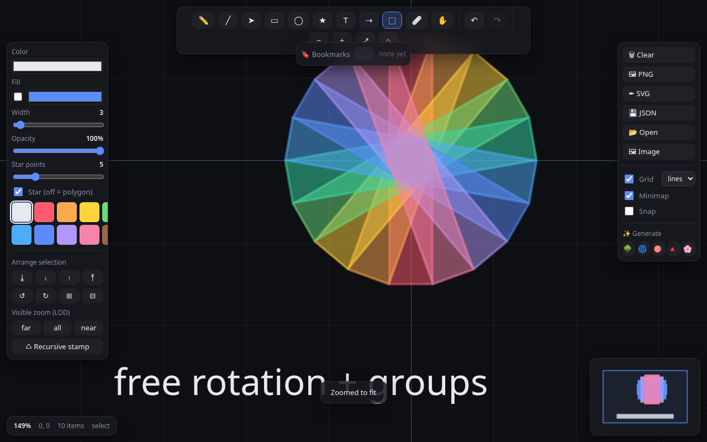

# ∞ Infinizoom

An **infinite-zoom vector drawing app** built with plain JavaScript, HTML, and
CSS — no frameworks, no build step — and driven by an extensive **Playwright
browser-automation test suite**.

Draw on an unbounded canvas, scroll to zoom across ~30 orders of magnitude, and
the lines stay crisp the whole way down (verified at 167,000× in the tests).


## Quick start

```bash
npm install                 # installs Playwright (browser auto-resolved, see below)
npm run serve               # serve at http://127.0.0.1:8231
npm test                    # run the full Playwright suite (auto-starts the server)
node tests/demo.js          # render the showcase gallery into screenshots/
```

Then open the served URL and draw.

## Features

**Drawing tools** — pen (freehand, RDP-simplified), **brush** (pressure / tapered),
line, arrow, rectangle, ellipse, star/polygon (3–12 points, star or regular), text,
**connector**, eraser, select, pan.

**Pressure brush** — the brush tool (`B`) lays down a variable-width, tapered
stroke: it reads a stylus's real pressure when there is one, and otherwise infers
it from pointer speed (fast = thin), so it feels alive even with a mouse. Each
stroke enters and leaves on a fine inked point, and it's drawn as a filled ribbon
that stays crisp at any zoom and exports to SVG as a single vector polygon. A
**Catmull-Rom smoothing** pass (toggle in the panel) rebuilds the path as a clean
curve through its points at draw time, so freehand lines read smooth without
bloating the saved file — the stored stroke keeps only its sparse control points.

**Connectors / diagramming** — with the connector tool (`C`), drag from one object
to another to link them. The connector stays glued to both, re-routing live as you
move, rotate, or zoom — and it's deleted automatically when either endpoint is.
Turns the infinite canvas into a zoomable diagramming surface.

**Infinite canvas**
- Zoom anchored at the cursor; pan with the hand tool, space-drag, or middle mouse.
- An **adaptive grid** that subdivides through powers of ten so there's always a
  sensible reference at any magnification, with highlighted world-origin axes.
- A **minimap** showing the whole document and the current viewport (click to jump).
- Viewport **culling** keeps it fast — 5,000 items render in ~11 ms; when you zoom
  in, only the handful of on-screen items are drawn.

**Editing** — multi-select (click, shift-click, marquee), move, **free rotation**
(drag the handle above the selection, or `.`/`,` for 15° steps; hold `⇧` to snap),
**resize** (drag a corner handle to scale uniformly about the opposite corner, or
use the ⤢/⤡ buttons and `>`/`<` keys for ±10% steps), **group / ungroup** (grouped
items select, move, rotate, and scale as one unit), **arrow-key nudge** (1px, or
×10 with `⇧`), per-item colour / width / **opacity**, fill, z-order
(front/back/raise/lower), copy/cut/paste, duplicate, an **eyedropper** (Alt+click
to sample a colour), and full undo/redo.

**Layers — lock & hide** — an **Objects panel** lists every item front-most-first
(the z-stack as a layer list); click a row to select it, or use its 👁 / 🔒 toggles
to hide or lock it. Hidden items vanish from the canvas, minimap, SVG export, and
hit-testing; locked items stay visible but can't be selected, moved, or erased
(though connectors can still snap onto them). Toggle the selection with the 🔒 / 👁
buttons or `Shift+L` / `Shift+H`, and recover everything at once with the panel's
*Show all* / *Unlock all*. All of it is undoable and round-trips through JSON.

**Images** — drag-and-drop an image file onto the canvas, paste one from the
clipboard, or use the 🖼 button. Images are first-class items: zoomable, movable,
rotatable, fade-able, LOD-taggable, and they round-trip through JSON and SVG.



**Infinite-zoom superpowers**
- **Level of detail (LOD):** tag items to appear only when zoomed in (`near`) or
  out (`far`) past the current level — build worlds nested inside worlds.
- **Recursive stamp:** drop progressively smaller copies of a selection toward its
  centre to hand-craft Droste-style fractals you can fall into forever.
- **Bookmarks:** save camera views and *fly* between them with eased, log-space
  zoom — even across billion-fold scale jumps.

**Stop-motion flipbook** — flip the 🎬 toggle (bottom-center) and the canvas turns
into a sticky-note flipbook: each page is an animation frame. Draw a page, add or
**duplicate** the page (copy then nudge — the classic stop-motion move), and repeat;
**onion skins** ghost the neighbouring pages so you can register the next drawing,
tinted warm for the previous page and cool for the next (the traditional-animation
convention). Scrub the slider or press ←/→ to flip through, hit ▶ to play it back
at an adjustable fps (looping optional), and only the live page is editable so you
never disturb the others. Every page op is undoable, and the whole flip-book
round-trips through JSON (each item just carries a `frame` index). Flipbook is off
by default, so the app is a plain infinite canvas until you want it.

**Zoom-dependent line width** — the *Width vs zoom* selector chooses how a stroke's
thickness responds to zoom: **Scale (world)** — the default — keeps width in world
units so lines thicken as you zoom in (drawing feels physical), while **Fixed
(screen px)** pins the on-screen thickness so a line reads the same weight at every
magnification (great for annotations on a deep-zoom scene). It applies to the
selection and to new strokes, and round-trips through JSON.

**Procedural art generators** — fractal tree, spiral squares, Droste rings,
Sierpinski triangle, flower field (the ✨ buttons).

**Persistence & export** — autosave to localStorage, plus JSON / SVG / PNG export
and JSON import.


## Keyboard shortcuts

| Key | Action | Key | Action |
|-----|--------|-----|--------|
| `P` pen · `B` brush · `L` line · `A` arrow | tools | `Ctrl/⌘ Z` / `⇧Z` | undo / redo |
| `R` rect · `O` ellipse · `S` star | tools | `Ctrl/⌘ A` | select all |
| `T` text · `C` connector · `V` select | tools | `Ctrl/⌘ C·X·V·D` | copy·cut·paste·dup |
| `E` eraser · `H` pan | tools | `Ctrl/⌘ G` / `⇧G` | group / ungroup |
| `+` / `-` | zoom in / out | `⇧L` / `⇧H` | lock / hide selection |
| `F` | zoom to fit | `]` / `[` | bring to front / send to back |
| `0` | reset view | `Ctrl ]` / `Ctrl [` | raise / lower |
| `G` | toggle grid | `Delete` · `Esc` | delete · clear selection |
| `.` / `,` | rotate selection ±15° | drag-drop / paste | place an image |
| `>` / `<` | scale selection ±10% | drag corner handle | resize selection |
| `←↑↓→` | nudge selection 1px (`⇧` ×10) | `Space`-drag · middle-drag | pan |
| `←` / `→` | flip pages (flipbook on, no selection) | 🎬 scrub · ▶ | navigate · play frames |

Hold `⇧` while drawing a line/arrow to snap angles, or a rect/ellipse/star to
keep it square. Hold `⇧` while dragging the rotation handle to snap to 15°.
**Alt+click** anywhere to eyedrop the colour under the cursor. **Drag-and-drop**
(or paste) an image file onto the canvas to place it.

## Architecture

```
index.html · style.css        page + UI
src/
  util.js        geometry, RDP simplify, formatting, color helpers
  camera.js      world↔screen transform, zoom-at-cursor, pan, fit
  scene.js       document model: items, bbox, hit-test, pick, JSON I/O
  history.js     undo/redo command stack
  renderer.js    canvas painting: adaptive grid, items (culled), selection
  minimap.js     overview + viewport rectangle
  generators.js  procedural-art functions
  svg.js         vector (SVG) export
  storage.js     localStorage + file import/export
  app.js         input, tools, UI wiring, render loop, and the test API
server.js        zero-dependency static file server
tests/           Playwright specs + standalone demo/smoke scripts
```

Geometry lives in unbounded `f64` **world coordinates**; the camera maps them to
screen pixels. Stroke widths are world-relative by default, so zooming feels
physical — or set a stroke's `widthMode` to `'screen'` to pin its on-screen weight.

### The test API

`app.js` exposes `window.__INFINIZOOM__` so tests (and you, from the console) can
drive everything headlessly: tools, styling, camera, items, undo/redo, generators,
LOD, stamp, bookmarks, images, rotation, grouping, connectors, lock/hide, the
pressure brush, **zoom-dependent line width**, the **stop-motion flipbook** (frames,
onion skins, playback), export, and pixel-level rendering checks. `window.app` is
the live instance.

## Testing notes

The suite (213 tests) covers core loading, drawing each tool, the camera (including
deep-zoom precision and culling), history, persistence, keyboard shortcuts,
generators, LOD, recursive stamp, bookmarks/fly-to, SVG export, clipboard,
performance, images, rotation, grouping, connectors, lock/hide layers, the
pressure brush, zoom-dependent line width, and the stop-motion flipbook.

> **NixOS:** Playwright's prebuilt Chromium can't run (missing dynamic linker), so
> the tests auto-resolve a Nix-store `chromium` via `tests/_helpers.js`. Set
> `IZ_CHROMIUM` to override, and `IZ_PORT` to change the port (default 8231).
